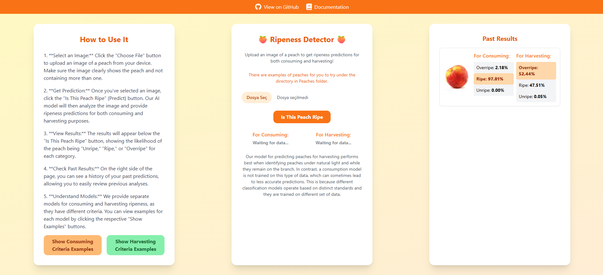
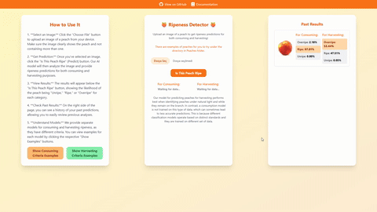

# 🍑 PeachRipenessCalculator: Şeftali Olgunluk Tespit Uygulaması

---

## 💡 Proje Hakkında

Bu proje, **derin öğrenme (Deep Learning)** tekniklerini kullanarak yüklediğiniz şeftali fotoğraflarının "**Olgun**", "**Olgunlaşmamış**" veya "**Aşırı Olgun**" kategorilerinden hangisine ait olduğunu belirleyen bir **web uygulamasıdır**. `IsThisPeachRipe` adını taşıyan bu uygulama, kullanıcıların yüklediği şeftali fotoğraflarının hem tüketim hem de tarımsal sınıflandırma açısından hangi olgunluk seviyesinde olduğunu yapay zeka yardımıyla tahmin etmeyi amaçlar. Uygulama dili olarak İngilizce tercih edilmiştir.

### 🌟 Temel Hedefler:
* Kullanıcıların şeftali olgunluğunu kolayca tahmin etmesini sağlamak.
* Tarımsal analizlere yapay zeka destekli bir bakış açısı sunmak.

---

## ✨ Özellikler

* **Gerçek Zamanlı Tahmin:** Kullanıcıların yüklediği şeftali fotoğrafına göre model, resmi üç sınıftan birine atayarak olgunluk durumunu **JSON formatında** anında yanıtlar.
* **Çoklu Model Desteği:** Projede farklı versiyonlarda (v1, v2.6, v2.9) eğitilmiş modeller bulunur. İlerleyen aşamalarda hangi modelin kullanılacağı kolayca değiştirilebilir.
* **Kullanıcı Dostu Web Arayüzü:** HTML sayfası üzerinden fotoğraf yükleme, önizleme ve “Tahmin Et” butonu ile kolay bir kullanım sunar.
* **API Entegrasyonu:** `/predict` uç noktası üzerinden dosya (`image/jpeg`, `image/png` vb.) kabul edilir, model tahmini yapar ve sonuçları JSON formatında döner.

---

## 🚀 Hızlı Başlangıç & Demo

Uygulamanın nasıl çalıştığını merak mı ediyorsunuz? İşte hızlı bir bakış ve demolar:

1.  **Uygulamayı Başlatın:** "Kurulum ve Çalıştırma" bölümündeki adımları takip ederek `app.py` dosyasını çalıştırın.
2.  **Web Arayüzünü Açın:** Tarayıcınızda `index.html` dosyasını açın.
3.  **Fotoğraf Yükleyin:** Arayüze bir şeftali fotoğrafı yükleyin ve tahmin sonucunu anında görün!


| Uygulama Arayüzü                       | Tahmin Sonucu Demousu                       |
| :------------------------------------- | :------------------------------------------ |
|  |  |

---

## 🛠️ Kullanılan Teknolojiler ve Kütüphaneler

Bu proje geliştirilirken aşağıdaki teknolojiler ve Python kütüphaneleri kullanılmıştır:

* **Python:** `3.8-3.12`
* **Flask:** `3.1.1`
    * Basit bir web sunucusu ve REST API oluşturmak için kullanılmıştır.
    * `flask` ve `flask-cors` (`6.0.0`) ile **CORS** (Cross-Origin Resource Sharing) ayarları yapılmıştır.
* **TensorFlow / Keras:** `2.19.0`
    * Önceden eğitilmiş `.h5` formatındaki derin öğrenme modellerinin yüklenmesi ve tahmin işlemleri için kullanılır.
* **Pillow:** `11.2.1`
    * Kullanıcıdan gelen ikili (binary) resim verisini okumak, `PIL.Image` objesine dönüştürmek ve uygun boyutlandırma/ön işleme (preprocessing) adımlarını gerçekleştirmek için kullanılır.
* **NumPy:** `2.1.3`
    * Görüntü verileri üzerinde matematiksel işlemler ve array/manipülasyonlar için kullanılır.
* **TailwindCSS (CDN üzerinden):**
    * Web arayüzünün hızlıca stilize edilmesi ve responsive tasarım için kullanılmıştır.

### 📊 Veri Kaynakları

* Projede kullanılan şeftali fotoğraflarının diğer kaynakları `kaynaklar.csv` dosyasında listelenmiştir.
* **Tarımsal sınıflandırma için kullanılan hazır dataset:**
    * [Peach Ripeness Dataset on Figshare](https://figshare.com/articles/dataset/Peach_/27125373/2?file=49467246)

---

## ⚙️ Kurulum ve Çalıştırma

Projenizi yerel ortamınızda çalışır hale getirmek için aşağıdaki adımları takip edebilirsiniz:

1.  **Python Sürümü Kontrolü:** Sisteminizde **Python 3.8-3.12** yüklü olduğundan emin olun.
2.  **Bağımlılıkları Yükleme:** Projenin tüm Python kütüphanesi bağımlılıkları `requirements.txt` dosyasında listelenmiştir. Bu kütüphaneleri yüklemek için terminalinizde şu komutu çalıştırın:
    ```bash
    pip install -r requirements.txt
    ```
3.  **Model Dosyalarını Yerleştirme:** GitHub deposunu kopyaladıktan veya indirdikten sonra, projenizin ana dizininde aşağıdaki model dosyalarının bulunması **zorunludur**:
    * `peach_ripeness_v1.h5`
    * `peach_ripeness_v2.6.h5`
    * `peach_ripeness_v2.9.h5`
    Aksi takdirde, `app.py` çalışırken “Model dosyası bulunamadı” hatası alırsınız.
4.  **Uygulamayı Başlatma:** Proje dizininizde iken `app.py` kodunu çalıştırın:
    ```bash
    python app.py
    ```
5.  **Web Arayüzüne Erişin:** Uygulama başarıyla başlatıldıktan sonra, web tarayıcınızda `index.html` dosyasını açın.
6.  **Kullanım:** Ekranınızın sol kısmında bulunan yönergeleri kullanarak şeftalinizin olgunluk seviyesini kolayca öğrenin!

---

## 👥 Grup Üyeleri ve Görevleri

Bu projenin geliştirilmesinde emeği geçen ekip üyeleri ve sorumlulukları:

* **031890030 Muhammet Emin Özpınar:** Grup liderliğini üstlendi, yapay zeka modellerinin eğitimini sağladı, tarımsal sınıflandırmayı yapacak modelin ihtiyaç duyduğu dataseti temin etti, kullanıcı arayüzüne kullanılabilirliği arttırıcı özellikler(How to Use It, Past Results,For Harvesting, Show Criteria Examples) ekledi.
* **032290080 Yusuf Heybeli:** Projede kullanıcı arayüzünü (UI) tasarladı ve bu arayüzün arka plandaki işlemlerle iletişim kurmasını sağlayan bir API geliştirdi.
* **032390004 Emirhan Berat Beyoğlu:** Farklı kaynaklardan şeftali fotoğrafları topladı, bunlara labeling işlemini uyguladı, olgunluk seviyelerine göre sınıflandırdı, arayüz kısmına github ve readme sekmesini ekledi. Github ReadMe dosyasını oluşturdu.
* **10299011014 Ramazan Çakıl:** Çeşitli kaynaklardan şeftali görselleri topladı, düzenledi, etiketledi ve kullanılabilir bir formda sundu. Ayrıca sitede örnek fotoğraflar sekmesi oluşturdu; farklı olgunluk seviyelerindeki kullanılabilir örnek fotoğrafları buraya ekledi.

---


# For English


# 🍑 PeachRipenessCalculator: Peach Ripeness Detection Application

---

## 💡 About The Project

This project is a **web application** that uses **deep learning (Deep Learning)** techniques to determine whether an uploaded peach photo falls into the categories of "**Ripe**", "**Unripe**", or "**Overripe**". Named `IsThisPeachRipe`, the application aims to predict the ripeness level of user-uploaded peach photos with the help of artificial intelligence, relevant for both consumption and agricultural classification.

### 🌟 Core Objectives:
* To enable users to easily predict peach ripeness.
* To provide an AI-powered perspective for agricultural analysis.

---

## ✨ Features

* **Real-time Prediction:** Based on the uploaded peach photo, the model classifies the image into one of three categories, returning the ripeness status in **JSON format** instantly.
* **Multi-Model Support:** The project includes models trained in various versions (v1, v2.6, v2.9). It's easy to switch which model is used in future stages.
* **User-Friendly Web Interface:** Offers simple usage through an HTML page for photo uploading, previewing, and a "Predict" button.
* **API Integration:** Accepts files (`image/jpeg`, `image/png`, etc.) via the `/predict` endpoint, performs model inference, and returns results in JSON format.

---

## 🚀 Quick Start & Demo

Curious about how the application works? Here's a quick overview and demos:

1.  **Run the Application:** Follow the steps in the "Setup and Running" section to execute the `app.py` file.
2.  **Open the Web Interface:** Open the `index.html` file in your browser.
3.  **Upload a Photo:** Upload a peach photo to the interface and see the prediction result instantly!


| Application Interface                       | Prediction Demo                       |
| :------------------------------------------ | :------------------------------------ |
|  |  |

---

## 🛠️ Technologies and Libraries Used

The following technologies and Python libraries were used in the development of this project:

* **Python:** `3.8-3.12`
* **Flask:** `3.1.1`
    * Used to create a simple web server and REST API.
    * **CORS** (Cross-Origin Resource Sharing) settings are configured with `flask` and `flask-cors` (`6.0.0`).
* **TensorFlow / Keras:** `2.19.0`
    * Used for loading pre-trained `.h5` deep learning models and performing inference.
* **Pillow:** `11.2.1`
    * Used to read binary image data from the user, convert it to a `PIL.Image` object, and perform appropriate resizing/preprocessing steps.
* **NumPy:** `2.1.3`
    * Used for mathematical operations and array manipulations on image data.
* **TailwindCSS (via CDN):**
    * Used for quickly styling the web interface and for responsive design.

### 📊 Data Sources

* Other sources for peach photos used in the project are listed in the `kaynaklar.csv` file.
* **Pre-trained dataset used for agricultural classification:**
    * [Peach Ripeness Dataset on Figshare](https://figshare.com/articles/dataset/Peach_/27125373/2?file=49467246)

---

## ⚙️ Setup and Running

To get the project up and running on your local machine, follow these steps:

1.  **Python Version Check:** Ensure **Python 3.8-3.12** is installed on your system.
2.  **Install Dependencies:** All Python library dependencies for the project are listed in the `requirements.txt` file. Install these libraries by running the following command in your terminal:
    ```bash
    pip install -r requirements.txt
    ```
3.  **Place Model Files:** After cloning or downloading the GitHub repository, the following model files **must** be present in your project's root directory:
    * `peach_ripeness_v1.h5`
    * `peach_ripeness_v2.6.h5`
    * `peach_ripeness_v2.9.h5`
    Otherwise, `app.py` will throw a "Model file not found" error when run.
4.  **Start the Application:** From your project directory, run the `app.py` code:
    ```bash
    python app.py
    ```
5.  **Access the Web Interface:** Once the application has successfully started, open the `index.html` file in your web browser.
6.  **Usage:** Follow the instructions on the left side of your screen to easily determine your peach's ripeness level!

---

## 👥 Group Members and Contributions

The team members who contributed to the development of this project and their responsibilities:

* **031890030 Muhammet Emin Özpınar:** Led the group, handled AI model training, secured the dataset required for agricultural classification, and added usability features to the user interface(How to Use It, Past Results,For Harvesting, Show Criteria Examples).
* 032290080 Yusuf Heybeli
* **032390004 Emirhan Berat Beyoğlu:** Collected peach images from various sources, applied labeling to them, classified them according to ripeness levels, and added the GitHub and README tabs to the user interface.
* **10299011014 Ramazan Çakıl :** He collected peach images from different sources, organized them, tagged them and sent them in a usable form. He also created a sample photos tab on the site; he added sample usable photos at different ripeness levels.
        

---

